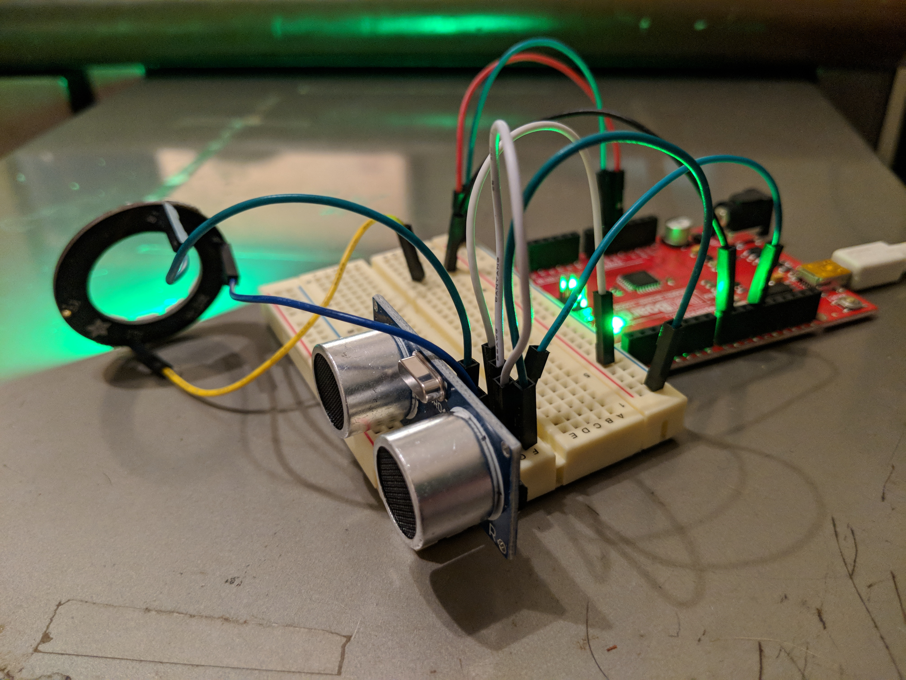

# FirmataExample

This is a repo for my talk at CODEBeamSF 2018, [Arduino, Elixir And Nerves: A Deep Dive Into the Firmata Protocol](https://www.codesync.global/speaker/christopher-cote/)

It's currently just a small app that reads data from an ultrasonic distance sensor and outputs the data to a [NeoPixel](https://www.adafruit.com/category/168) in several different visualizations.

It also contains some simple animations for the NeoPixel, `follow` and `pulse`, written in Elixir.

All the Arduino code you need to run this example is in the `arduino` directory. Make sure to install all the libraries in the `libraries` directory into your Arduino IDE before compiling and flashing. Open `StandardFirmata` and compile and flash to your Arduino board.

